```{r setup, include=FALSE}
knitr::opts_chunk$set(echo = TRUE)
```

# Šta su otvoreni podaci i čemu služe 

Otvoreni podaci deo su širokog globalnog pokreta koji ne samo da unapređuje nauku i naučnu komunikaciju, već transformiše moderno društvo i način donošenja odluka. Podaci, LifeBlood našeg novog globalnog životnog sistema, ključni su resurs za rješavanje velikih ne samo lokalnih, već i globalnih izazova današnjice.

```{r echo=FALSE, fig.align = 'center', fig.cap = "Izazov otvorenih podataka", out.width = "75%"}
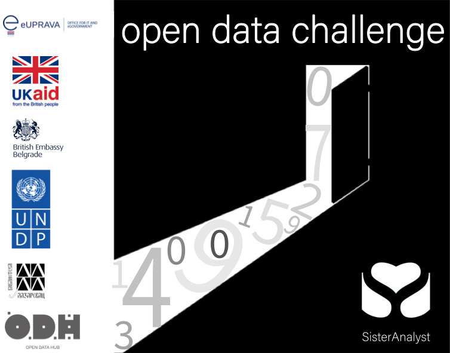
```

Stvarna vrednost otvorenih podataka nije samo u tome što se pojedinačne baze podataka mogu šire koristiti, već u tome da se ti podaci takođe mogu koristiti, deliti i kombinovati sa drugim podacima. Otvoreni podaci olakšavaju naučne saradnje, obogaćuju istraživanja i generalno unapređuju analitičke kapacitete za donošenje odluka.
U demokratskom društvu koje dobro funkcioniše, građani moraju znati šta njihova vlada radi. Da bi to učinili, moraju imati slobodan pristup državnim podacima i informacijama i deliti te informacije sa drugim građanima.

O otvorenim podacima ne možemo da pričamo, a da ne pomenemo transparentnost. Transparentnost nije samo pristup, već i deljenje i reproduciabilnost, tj. ponovna upotreba - često, da bi se podaci razumeli, potrebno ih je analizirati i vizualizovati, a to zahteva da podaci i sav materijal koriscen za njihovu analizu i rezultati budu otvoreni kako bi se sve moglo slobodno i ponovo koristiti. Time se dobija na vrednosti i validaciji ne samo process analize podataka, već i samih podataka.

Otvaranjem podataka građanima se omogućava mnogo direktnije informisanje i uključivanje u donošenje odluka. Ovo je više od transparentnosti: omoogucava se „pristup, tj. čitanje" i "kreiranje, tj. pisanje“ podataka. Reč je ne samo o znanju o tome šta se dešava u procesu upravljanja, već i o mogućnosti da tome kao gradjani doprinosimo.
Država otvaranjem podataka i činjenjem pristupu informacijama slobodnim kreira podatke kao društveno dobro koje može da se iskoristi za razvoj preduzetničkih biznisa i poslovnih sistema. Preduzetnici imaju sposobnost rešavanja problema, ali im često nedostaju resursi da pokrenu svoje poduhvate. Bilo bi im teško uložiti u nabavku podataka koji su često vrlo skupi. S druge strane, vlade pokušavaju da reše mnoge probleme, ali im nedostaju sposobnosti za rešavanje problema koje imaju preduzetnici. Stoga se vlade i preduzetnici udružuju kako bi rešili zajedničke probleme. Time vlada omogućava preduzetnicima da pokažu svoje talente i pokrenu svoje poduhvate.

## Efikasno ispitivanje zasnovano na podacima

Analizom podataka možemo da prodremo u činjenice, koje su na oko skrivene u podacima, uz pomoć kojih možemo da verifikujemo pretpostavke, uočimo nove mogućnosti, izazove i probleme do kojih može doći i shodno tome kreiramo planove. Instikte podžane spoznajom činjeničnog stanja i analitičkog načina razmišljanja je lakše pratiti i uzeti u obzir. Razotkrivanje postojećih činjenica omogućava proaktivnije donošenje odluka uz veću samouverenost i kompetentnost. 

Bez obzira koju vrste analize podataka radite njen proces je u biti uvek isti. On počinje postavljanjem pitanja i definisanjem problema.

```{r echo=FALSE, fig.align = 'center', fig.cap = "Proces analize podataka", out.width = "75%"}
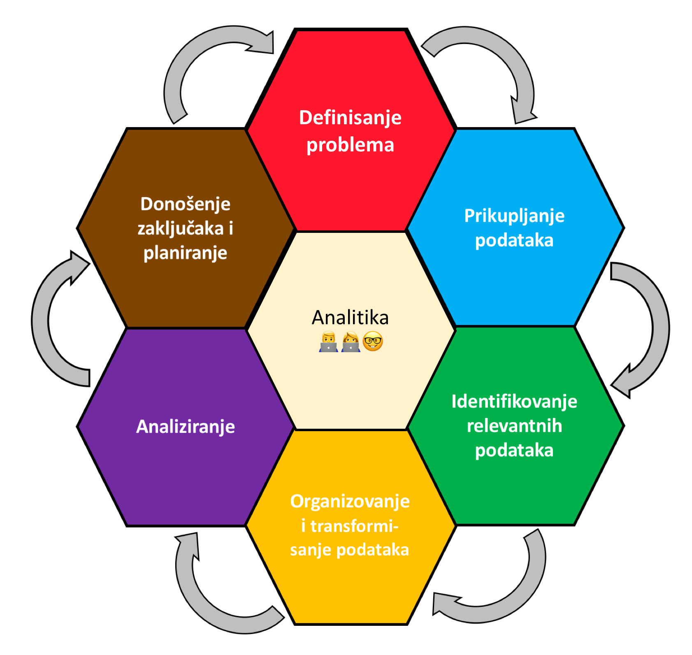
```

Za „dobro“ analitičko razmišljanje je korisno biti kreativan, kritičan i pedantan. Umeti postaviti precizna pitanja i biti kreativan u pronalaženju njihovih rešenja je suštinski deo procesa analize podataka. 

Postavljanje pitanja je osnovni pokretač procesa analize podataka. Ona navode na pronalaženje činjenica sadržanim u podacima iz kojih se mogu izvući konkretni zaključci. Ovi zaključci pomažu u pronalaženju idejnih rešenja. Efektivno postavljanje pitanja pomaže efektivno sprovođenje procesa analize.

U toku faze definisanja problema potrebno je pažljivo formulisati pitanja i detaljno sagledati očekivanja svih njegovih aktera uključenih u aktivnost. To zahteva strpljenje i preciznost u koje se isplati uložiti trud jer će kasnije pomoći da se dođe do uspešnijeg cilja.

Osnovno pitanje od kojih je najbolje poći u potrazi za rešenja identifikovanih probleme jeste: **Zašto?** Zašto problem postoji; zašto su uzročnici prisutni?... Pitanje gde? je takođe korisno u identifikovanju postojećih ili potencijalnih problema. **Gde?**; na koji deo posmatranog procesa treba da postavimo fokus kako bi omogućili uspešno ostvarivanje cilja? **Šta?** je to što zahteva našu pažnju i šta treba preduzeti da bi uspešno došli do željenog stanja. Postavljanje pitanja igra bitnu i važnu ulogu u procesu analize podataka. Analitički način razmišljanja i postavljanje dobro kreiranih pitanja ima veliki impakt na proces analize podataka. 

Korišćenjem obe vrste podataka: **kvantitativnih** i **kvalitativnih** i konstantnom primene procesa analize nad prikupljenim podacima i dobijenim rezultatima, moguće je prodreti u srž problema. Neophodno je pristupiti problemu na sistematičan način koji podrazumeva postavljanje logički povezanih pitanja.

Komunikacija dobijenih rezultata je vrlo bitan deo faze analize. Ceo proces analize je beskoristan ukoliko rezultati nisu iskomunicirani na efektivan način. Opis problema i postavljanje pitanja samo su prva faza celokupnog procesa analize koji završava kreiranjem izveštaja o analizama, novim informacijama, zaključcima i odlukama koje je moguće na osnovu ovih rezultata doneti.

Grafičko prikazivanje ili ti vizualizacija rezultata je ključna za pojednostavljivanje njihovog tumačenja. Vizualizacije pomoću grafikona, mapa i tabela često mogu da prikažu kompleksnu priču izvučenu iz podataka na jednostavan i privlačan način. Dobra vizualizacija može da privuče pažnju i onih koji u suprotnom možda nebi bili zainteresovani za tematiku. Vizualizacija treba da omogući jasno uočavanje činjenica izvučenih iz podataka i da navede na nova razmišljanja i nova pitanja. Na kraju, rezultati analize treba da omoguće jasno donošenje zaključaka na osnovu činjeničnog stanja sagledanog kroz podatke.   

## Vizualizacija podataka

Grafički metodi uobičajeno se upotrebljavaju u istraživačkoj fazi analize podataka. Za istraživanje podataka upotrebljavaju se različiti tipovi grafičkih alata: boxplotovi, scatter matrice, dijagrami/stabla i mnogi drugi. U ovom delu kursa upoznaćemo vas sa praktičnim rešenjima izbora najboljih tipova grafikona za izradu grafičkih prikaza koji će vam služiti da komunicirate vaše nalaze

1) ciljanoj publici
2) čitaocima kako bi jasno videli rezultate vaših istraživanja
3) da bi ih učinili lakše razumljivim

### Grafički obrasci::kodiranje

Dobri i jasni grafici zasnovani su, pre svega, na pouzdanim podacima. Prvi princip efektne vizuelizacije je prezentacija pouzdanih podataka. Tip informacije koju želite da komunicirate i prikažete, diktiraće izbor najprikladnijeg načina grafičkog kodiranja podataka kako bi grafikoni postali uočljiviji. Zato je bitno shvatiti problem koji želite da komunicirate i vrstu podataka koji su vam potrebni za njegovo komuniciranje iz statističke perspektive, tj. da li su podaci numerički, kategorički (ordinalni ili nominalni), vremenski (vremenska dimenzija) ili predstavljaju geografski položaj (prostorne dimenzije) u slučaju vremensko-prostornih podataka?

```{r echo=FALSE, fig.align = 'center', fig.cap = "Mapa i njen format", out.width = "75%"}
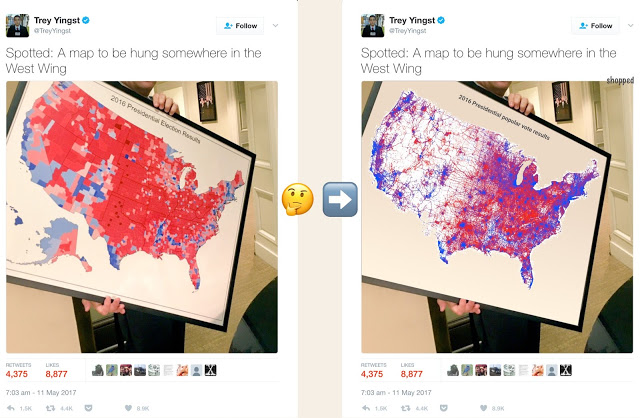
```

Vizuelno kodiranje setova podataka zavisi od broja i karakteristike raspoloživih atributa tj. varijabli i od analitičkog problema o kojem je reč. [Alberto Cairo](http://albertocairo.com/) u svom blogu [The Functional Art](http://www.thefunctionalart.com/2013/08/in-infographics-steal-what-you-need-but.html) daje listu grafikona upotrebljavanih za prezentacije različitih podataka i/ili različite funkcije prezentacije. Sledeća fugura illustruje različitee grafičke prikaze zadatka u zavisnosti od različite percepcije koju su dobro uočili u svom revolucionarnom [radu](http://euclid.psych.yorku.ca/www/psy6135/papers/ClevelandMcGill1984.pdf) Kliveland i Mekgil koji su razvili dok su radili u čuvenom AT&T Bell Labs, u istraživanju objavljenom u časopisu [JASA](https://amstat.tandfonline.com/toc/uasa20/current).

```{r echo=FALSE, fig.align = 'center', fig.cap = "Funkcionalni formati", out.width = "75%"}
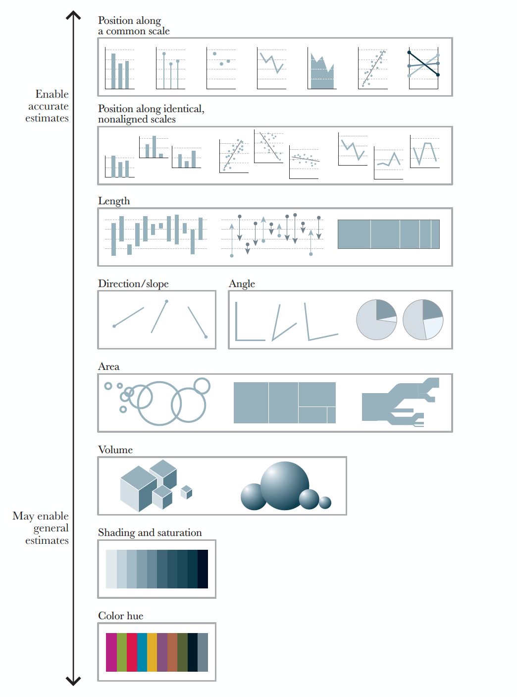
```

Grafikon ilustruje pregled grafičkih formi koje se mogu upotrebljavati za predstavljanje podataka tako da se istakne zaključak koji čitalac može doneti iz različitih formata. Na primer, ako je cilj grafikona da predstavi i olakša precizna poređenja, [Alberto](http://albertocairo.com/) u svojoj knjizi [The Functional Art](http://ptgmedia.pearsoncmg.com/images/9780321834737/samplepages/0321834739.pdf) donosi efikasne ilustracije za različite grafičke oblike koje bi mogli da koristite.

```{r echo=FALSE, fig.align = 'center', fig.cap = "Izbor grafičkog formata", out.width = "75%"}
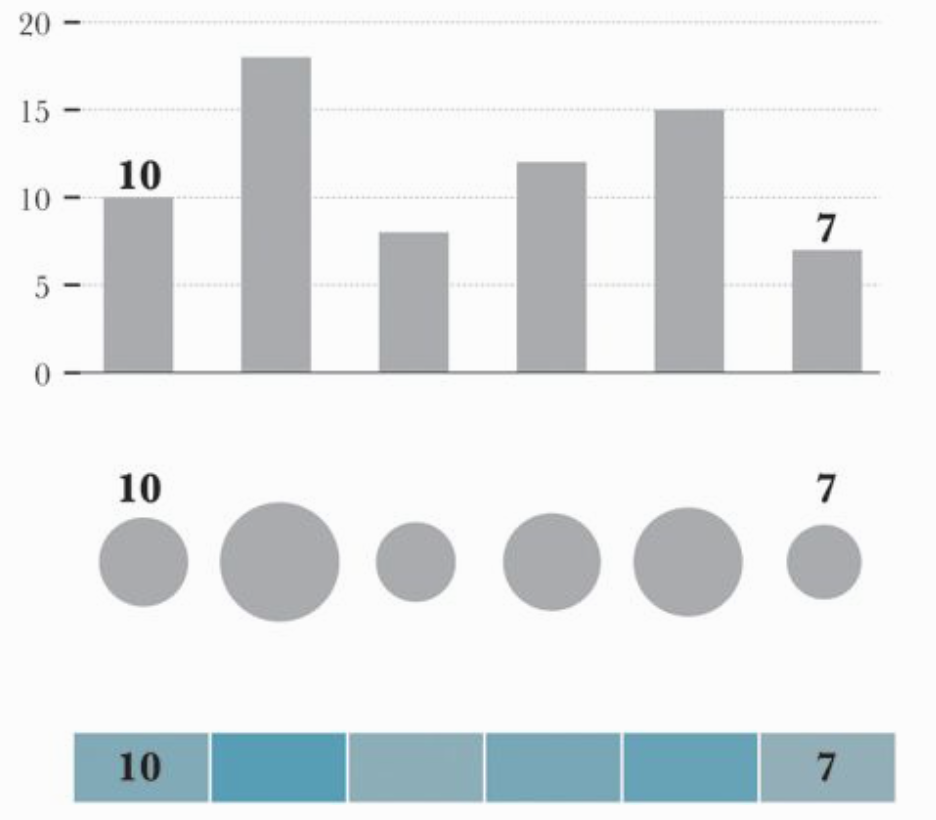
```

Ne postoji posebna razvijena metodologija za izbor najprikladnijih načina kodiranja podataka. Nikada unapred ne znate da li će određeni vizuelni format funkcionisati sve dok to ne proverite. Izbor će najviše zavisiti od toga koji se atributi upotrebljavaju. Međutim, postoje određene smernice nekoliko autora koje vam preporučujemo da pogledate:

- [The Data Visualisation Catalogue](https://datavizcatalogue.com/) by [Severino Ribecca](http://www.severinoribecca.one/)
- [Chart Chooser](https://depictdatastudio.com/charts/) by [Depict Data Studio](https://depictdatastudio.com/) and
- [Visual Vocabulary](https://github.com/Financial-Times/chart-doctor/blob/main/visual-vocabulary/FT4schools_RGS.pdf) by [the Financial Times Visual Journalism Team](https://github.com/Financial-Times/chart-doctor/tree/main/visual-vocabulary)

Često, grafički prikaz informacija koji nam daju odgovor na postavljeno pitanje sugerisaće na dalja potrebna istraživanja, zbog čega je važno da ih predstavimo na jasan i istinski način. Ne treba zaboraviti da je jedina svrha analiza podataka, dakle vizualizacije, informisanje i unapređenje znanja. Dakle, treba vrlo pažljivo razmotriti estetsku privlačnost i dizajn grafikona koje stvaramo kako bismo što efikasnije angažovali publiku, ali na način da nam je fokus pre svega na tačnosti, dubini i jasnoći informacija koje prikazujemo.

### Određivanje načina kodiranja

Započnimo igru „određivanja načina kodiranja“. Razgovarajte sa kolegama i napravite listu grafičkih formi i vrstu kodiranja koju bi koristili za svaku od sledećih vizualizacija.

1) Vizuelizacija: [DESI](https://digital-strategy.ec.europa.eu/en/policies/desi)

```{r echo=FALSE, fig.align = 'center', fig.cap = "Indeks digitalne ekonomije i društva", out.width = "75%"}
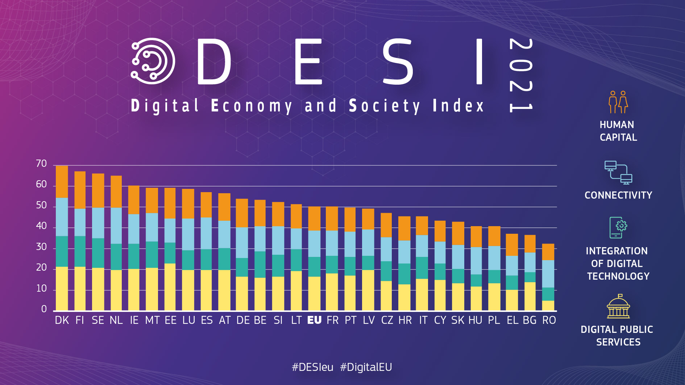
```

2) Vizuelizacija: [DESI Report 2019 - Human Capital](https://digital-strategy.ec.europa.eu/en/policies/desi-human-capital)

```{r echo=FALSE, fig.align = 'center', fig.cap = "Dnevna i nedeljna upotreba interneta u EU", out.width = "85%"}
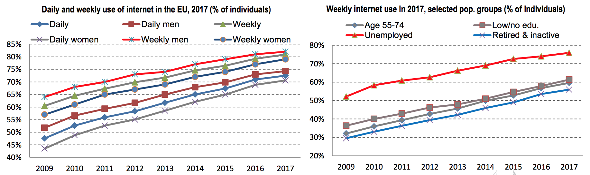
```

3) Vizuelizacija: [DESI Report 2019 - Human Capital](https://digital-strategy.ec.europa.eu/en/policies/desi-human-capital)

```{r echo=FALSE, fig.align = 'center', fig.cap = "Zaposlenost u informaciono-komunikacionim tehnologijama", out.width = "85%"}
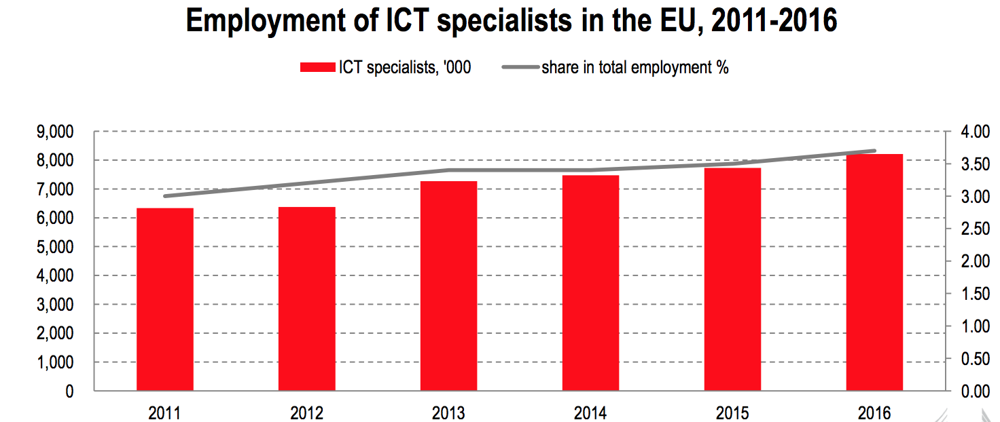
```

4) Kliknite na vizuelizaciju: [Gapminder Bubble Chart](https://www.gapminder.org/tools/#$chart-type=bubbles&url=v1)

```{r echo=FALSE, fig.align = 'center', fig.cap = "Zaposlenost u informaciono-komunikacionim tehnologijama", out.width = "85%"}
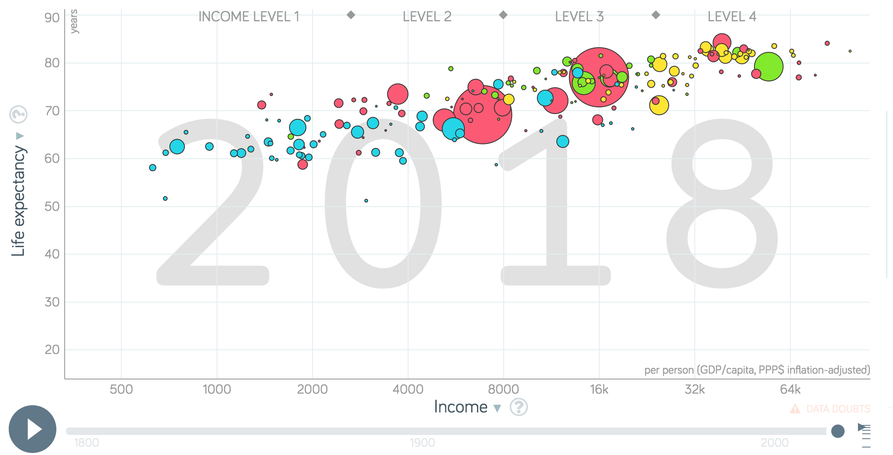
```

5) Kliknite na vizuelizaciju: [Gapminder World Population](https://www.gapminder.org/tools/#$chart-type=map&url=v1)

```{r echo=FALSE, fig.align = 'center', fig.cap = "Zaposlenost u informaciono-komunikacionim tehnologijama", out.width = "85%"}
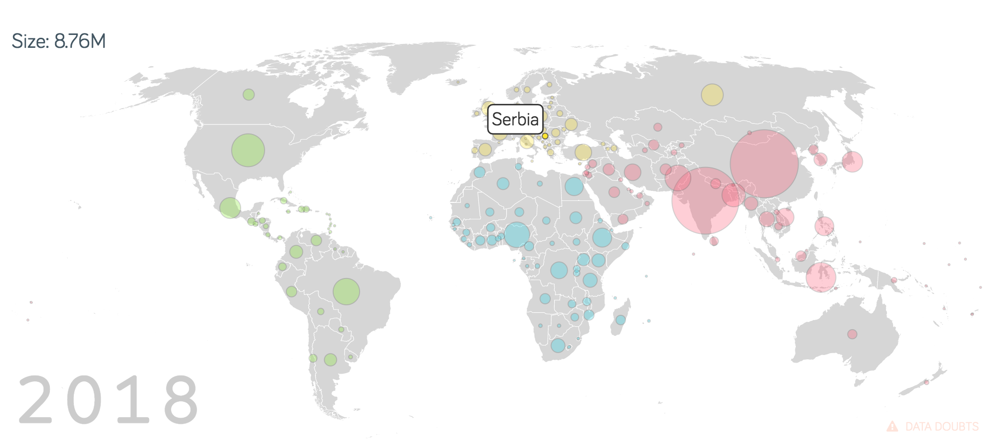
```


6) Kliknite na vizuelizaciju: [Periodic Table](https://www.rsc.org/periodic-table)

```{r echo=FALSE, fig.align = 'center', fig.cap = "Zaposlenost u informaciono-komunikacionim tehnologijama", out.width = "85%"}
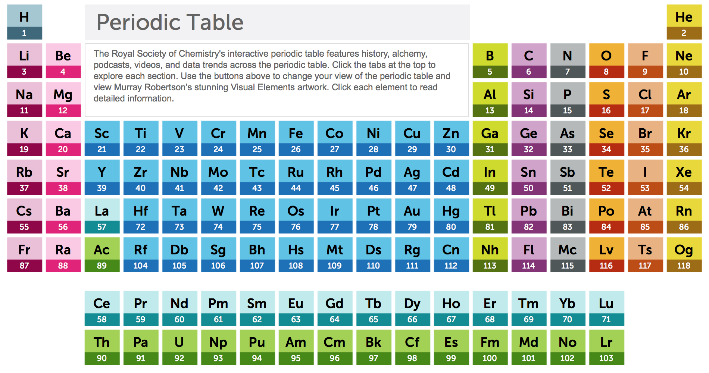
```

Takođe, kliknite i na sledeću vizuelizaciju: [A Periodic Table of visualisation methods](https://www.visual-literacy.org/periodic_table/periodic_table.html)

### Kompleksnost: efikasan vizuelni dizajn

Najvažnija što treba da zapamtite pri kreiriranju grafičke prezentacije podataka je da one moraju biti jasne i istinite. Skala koju treba da izaberete za prikaz podataka treba da bude dovoljno osetljiva da se vide promene u podacima, a u isto vreme da omogući komuniciranje različitih delova te skale i preciznih vrednosti na njoj. Prikaza statistka na grafikonu treba bude jasan i da sadrži izvore informacija i kalkulacija koje su upotrebljene za proračun. 

Evo nekih najočiglednijih problema na koje morate obratiti pažnju prilikom kreiranja efikasnih grafikona:

1) **Izaberite odgovarajuću skalu** za svoje grafikone koja će uspostaviti ravnotežu između prikazivanih trendova i skale orginalnog skupa podataka. Grafikon ne mora da počinje sa nulom da bi se uspostavila smislena osnovna linija ako postoji druga logička početna tačka. [Dual-Scaled Axes in Graphsđ](https://www.perceptualedge.com/articles/visual_business_intelligence/dual-scaled_axes.pdf)

```{r echo=FALSE, fig.align = 'center', fig.cap = "Izbor skale", out.width = "85%"}
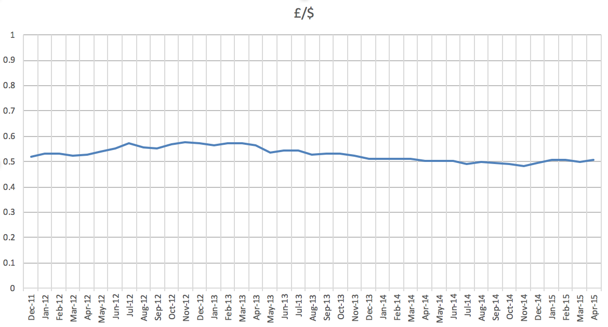
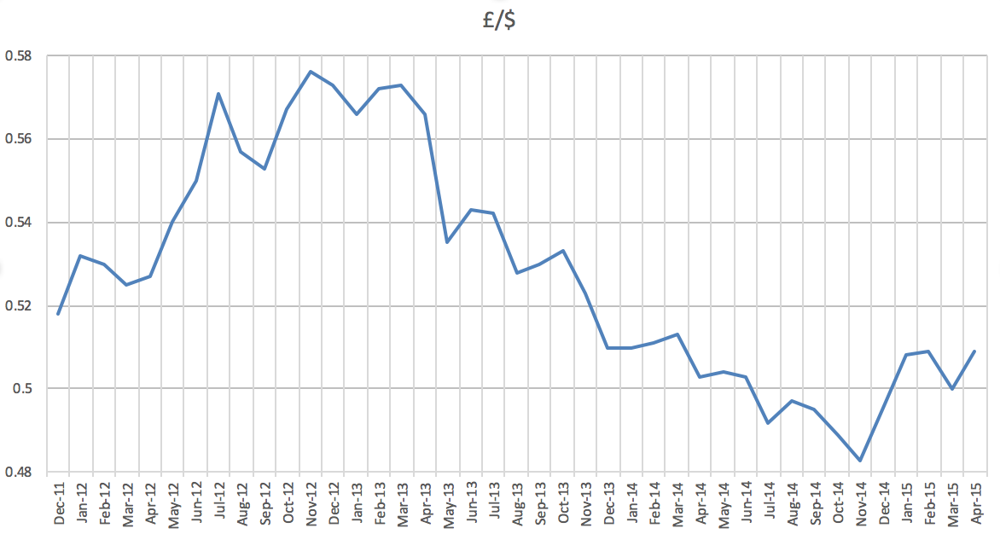
```

Izbor skale treba da omogući lakše iščitavanje informacije prikazane na grafikonu.
Pogledajte post [What to consider when creating a line chart](https://blog.datawrapper.de/line-charts/) autorke [Lisa Charlotte Rost](https://blog.datawrapper.de/), u kojoj ćete naći još neke interesantne linkove povezane sa ovom temom.

2) **Naglasite šta je važno**: Identifikujte ključne informacije koje želite da komunicirate i razmislite o najefikasnijem formatu za to. Imajte na umu da vam grafikoni pomažu u prikazivanju i predstavljanju složenih podataka u jednostavnom formatu. Prikazivanje važne stavke u drugoj boji je jednostavan način da skrenete pažnju na tu određenu vrednost.

```{r echo=FALSE, fig.align = 'center', fig.cap = "Nagalsak na bitno", out.width = "85%"}
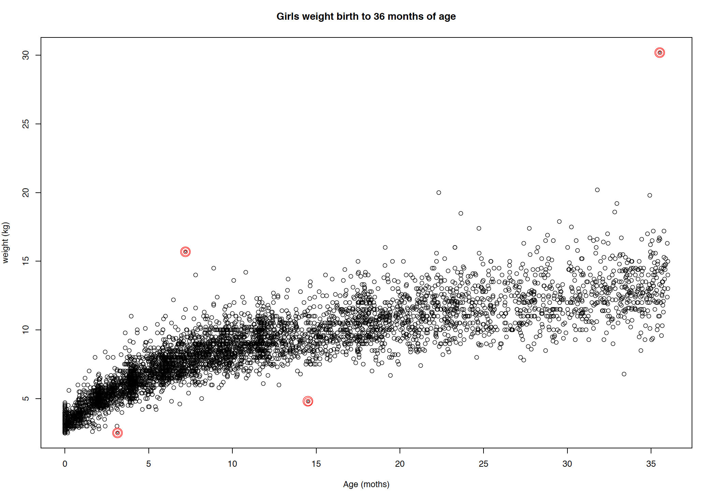
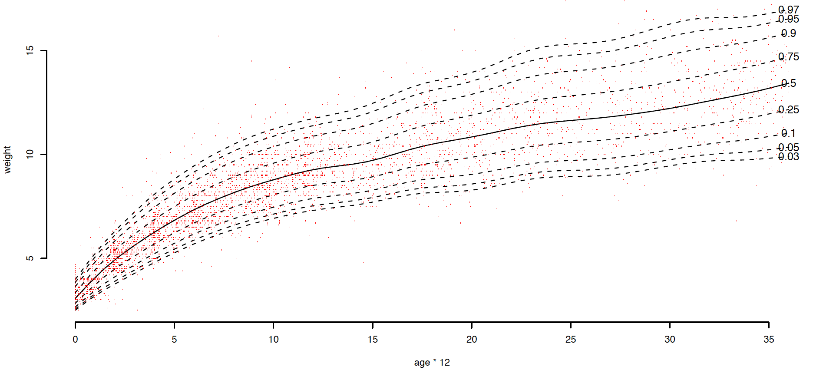
```

Ponekad bi bilo efikasno da ključne podatke iz grafikona izdvojite u odvojene grafikone i predstavite ih paralelno.

```{r echo=FALSE, fig.align = 'center', fig.cap = "Izdvajanje bitnog", out.width = "85%"}
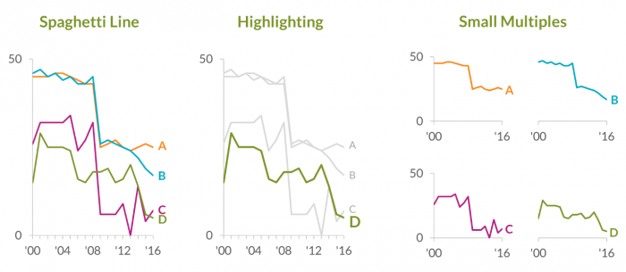
```

> Imajte na umu da informacije na grafičkom prikazu ne bi trebale biti zbunjujuće.


3) **Pojednostavite grafikon – budite jednostavni** s obzirom da efektne vizuelizacije daju podacima mogućnost da ispričaju priču. Grafovi ne izgledaju bolje ako gomilaju informacije ili su osmišljeni "fancy viz" veštinama. Uspešna vizuelizacija podataka je osetljiv čin uravnoteženja između forme i funkcije. Zadržite fokus na važnim tačkama smanjujući nepotrebne vizuelne podražaje.

```{r echo=FALSE, fig.align = 'center', fig.cap = "Nagalsak na bitno", out.width = "85%"}
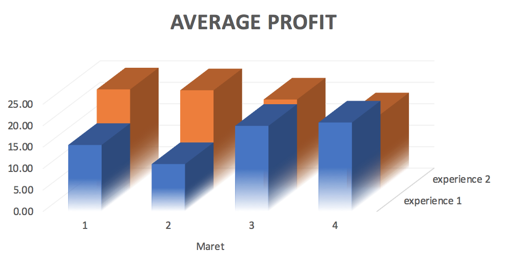
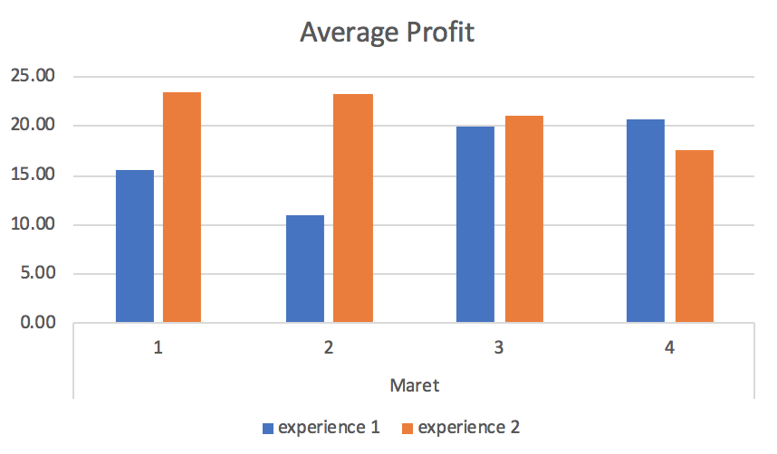
```

Integrišite tekst na grafikonima samo ako je to potrebno da biste lakše preneli informacije prikazane na njima.

```{r echo=FALSE, fig.align = 'center', fig.cap = "Dodavanje teksta", out.width = "85%"}
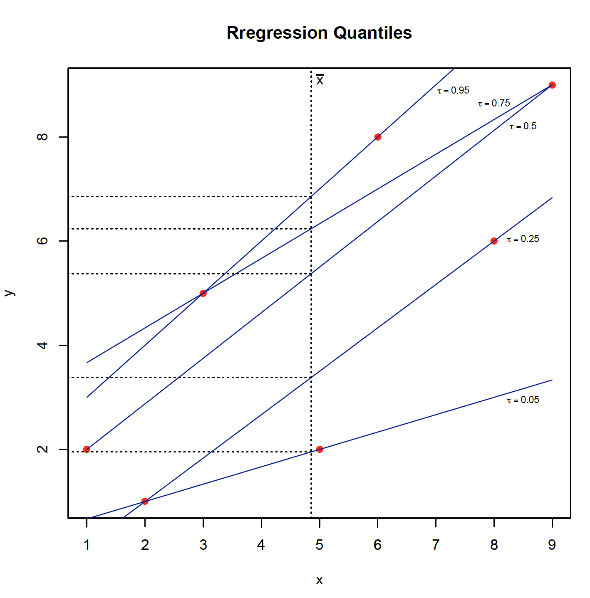
```

U [sledećoj prezentaciji](https://ec.europa.eu/eurostat/cros/system/files/Alberto%20Cairo%20BRUSSELS_NEW_VisualizationForEveryone.pdf) [Alberto Cairo Kairo](about:blank) ilustruje važnost dobrog izbora formata vizuelizacije priče “Kako se muzički ukus promenio za dve decenije”.

```{r echo=FALSE, fig.align = 'center', fig.cap = "muzička preferencija", out.width = "85%"}
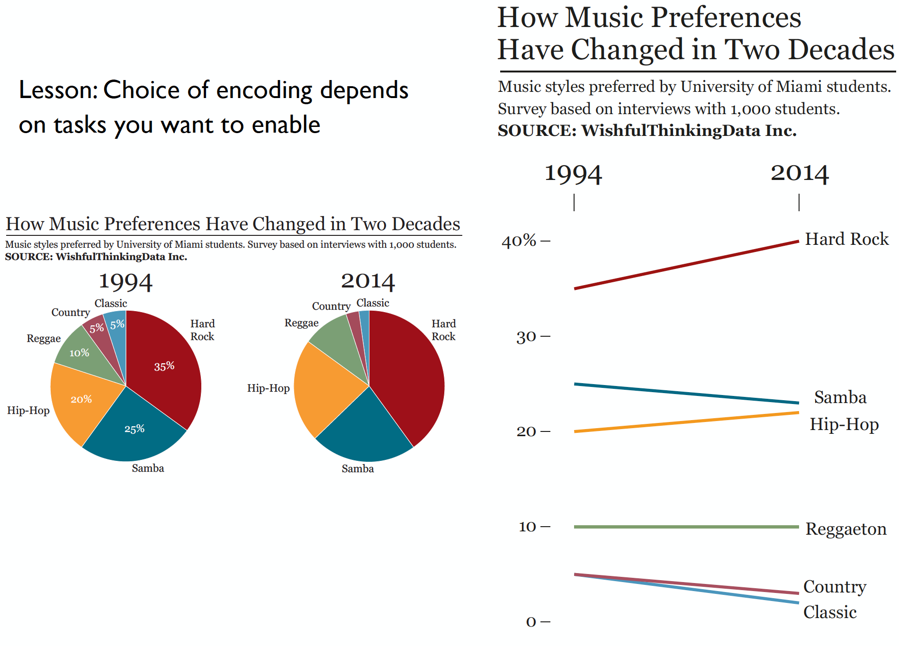
```

> Prilikom kreiranja vizuelizacije podataka razmislite o konkretnim informacijama koje želite da prenesete, ili o rezultatu koji želite da postignete. Budite jednostavni i uklonite sve nepotrebne elemente koji vam mogu zamagliti vašu prezentaciju. Nepotrebni podaci samo će zbuniti vaše čitaoce.

### Napredne tehnike

Kada kreirate grafički prikaz, fokusirajte se na dobre prakse i istražite svoj lični stil. Naučite kako da istražujete i rezimirate vaše podatke kao i kako da identifikujete njihova glavna obeležja koja će vam pomoći da ih vizuelno prezentujete.

#### Dvo-osni grafici

Postoji uverenje da su grafikoni sa dve različite y-ose teški za čitanje jer čine teškim razaznati dva seta informacija. Druga sekundarna y-osa na grafikonu često stvara zabunu i nije jasno koji od podataka se odnosi na koju osu. Njihova glavna odlika je da nisu intuitivni. Često umeju da stvare konfuziju i da pretpostavljaju veze između podataka tamo gde ih nema. Međutim, [Stephen Few](https://www.perceptualedge.com/about.php) je napisao dobro argumentovan tekst [Dual-Scaled Axes in Graphsđ](https://www.perceptualedge.com/articles/visual_business_intelligence/dual-scaled_axes.pdf) u kojem pažljivo predstavlja izazove koje treba imati u vidu kod ovakvih grafika. Neophodno je da sami odlučite hoćete li ih koristiti ili ne. Ta odluka treba da zavisi od vašeg suda da li su oni dobri za vaše vizulene priče i da li ih možete upotrebi kao i bilo koji drugi grafički format.

```{r echo=FALSE, fig.align = 'center', fig.cap = "Dualna skala", out.width = "85%"}
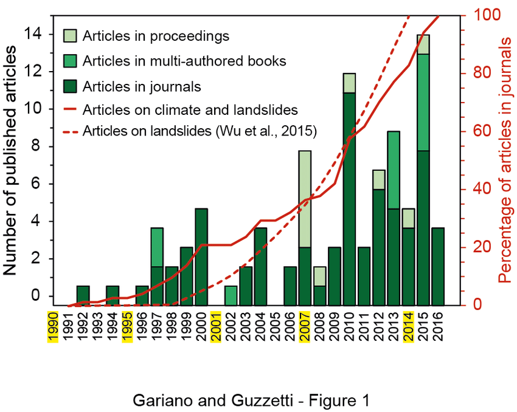
```

### Interaktivni grafikoni

Interaktivnost omogućuje čitaocima da kreativnije pregledaju podatke, na načine na koje to nije moguće raditi sa statičkim grafikonima. Glavna korist od interaktivne vizuelizacije podataka je njihova fleksibilnost koja omogućuje dalju manipulaciju i njihovo istraživanje. Korišćenje „zoom in“ opcije daje uvećani prikaz podataka koji su manje vidljivi. Time ih je moguće učiniti dodatno vidljivijim čime se omogućava čitaocima da se dodatno zaintrigiraju da istraže podatke. Interaktivni način predstavljanja podataka je bogat i snažan alat za prikaz osobina podataka i omogućuje čitaocima da urone u njih u zavisnosti od njihovog nivoa interesovanja.

Kliknite na vizuelizaciju: [CINS: Odakle dolaze donatori](https://www.cins.rs/sns-sps-i-ds-za-sedam-godina-gradjani-strankama-donirali-oko-15-milijardi-dinara/)

```{r echo=FALSE, fig.align = 'center', fig.cap = "Partijske donacije", out.width = "85%"}
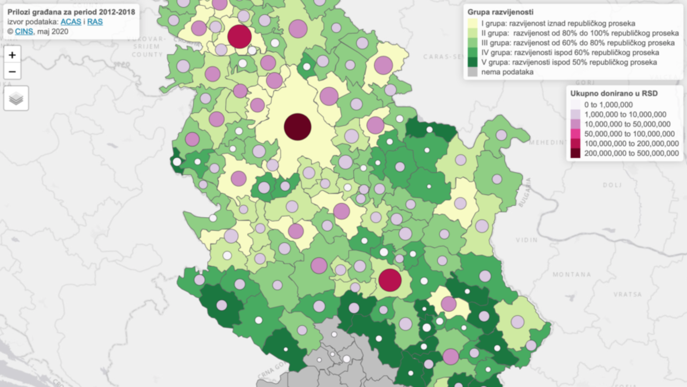
```


## Izveštavanje

Ceo proces analize je beskoristan ukoliko rezultati nisu iskomunicirani na efektivan način. Opis problema i postavljanje pitanja samo su prva faza celokupnog procesa analize koji završava kreiranjem izveštaja o analizama, novim informacijama, zaključcima i odlukama koje je moguće na osnovu ovih rezultata doneti. Raporti su periodični izveštaji kreirani na osnovu prikupljenih informacija iz prošlosti i obično su statičnog tipa u vidu Word dokumenta ili recimo PowerPoint prezentacije. Da bi se omogućilo praćenje toka stanja i uzele u obzir nove informacije, neophodno ih je redovno ažurirati. Postoji takodje i dinamičan način izveštavanja koji se naziva Komandna Tabla (Dashboard) koji omogućava konstantno ažuriranje novim podacima i omogućava interaktivnu komunikaciju sa korisnikom. Kao primer pogledaj mapiranje saobraćajnih nezgoda na teritoriji Beograda: https://tatjana.shinyapps.io/TrafficAccidents/

```{r echo=FALSE, fig.align = 'center', fig.cap = "Saobraćajne nezgode", out.width = "75%"}
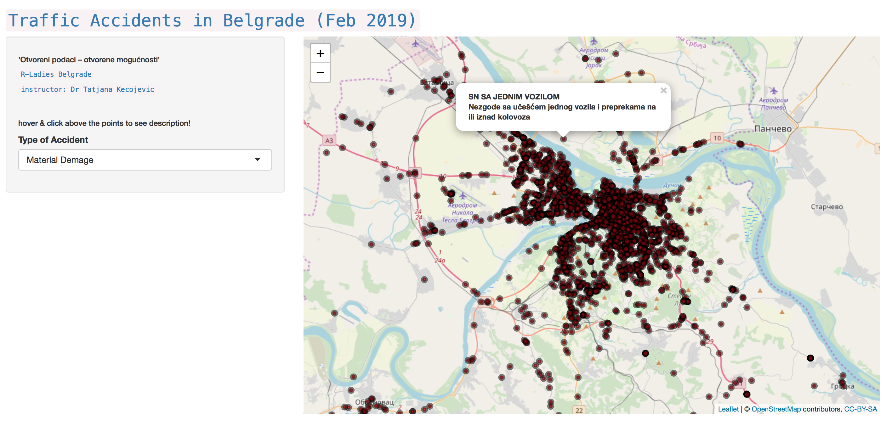
```
---

> ### Izazov: Određivanje načina kodiranja
>
>Nastavimo započetu igru „određivanja načina kodiranja“. Razgovarajte sa kolegama i napravite listu grafičkih formi i vrstu kodiranja koju bi koristili za neko od podataka koje smatrate interesantnim sa portala otvorenih podataka Republike Srbije: [https://data.gov.rs/sr/](https://data.gov.rs/sr/).

---

### Alati za analizu otvorenih podataka

[R](https://www.r-project.org/) zajedno sa [RStudiom](https://www.rstudio.com/) je najbolji alat za rad sa podacima! To je besplatni softver iz javnog domena koji je dostupan svima koji žele da otkriju, uče, istražuju, prošire i dele algoritme svog putešestva kroz podatke.

Instrukcije kako da instalirate R i RStudio možete pronaći na sledećoj stranici: (Instalacija R i RStudia)[https://instalirajr.netlify.app]

### Data Democracy: How to Shiny? 🤩

Podjimo od nečega što je već urađeno i što može da nam pruži ideje o mogućnostima rada sa otvorenim podacima.

Skinite repository: https://github.com/TanjaKec/HowToShiny

```{r echo=FALSE, fig.align = 'center', fig.cap = "GitHub Repository", out.width = "85%"}
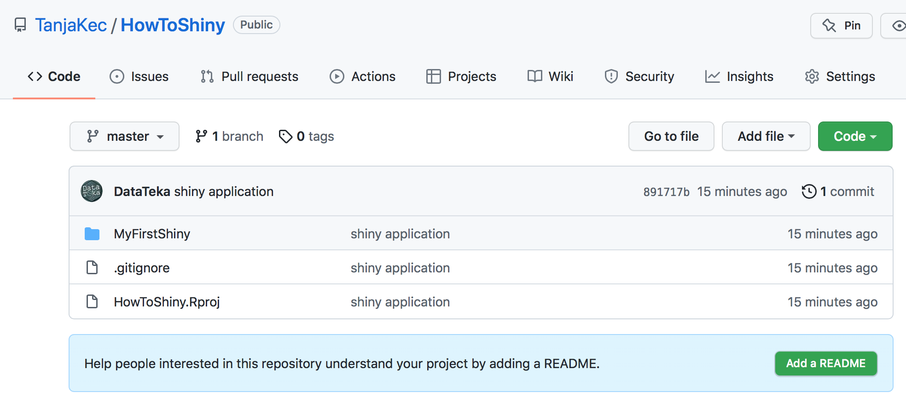
```

i kliknite na fajl `HowToShiny.Rproj` kako bi ste pokrenuli R/RStudio.

U narednim koracima ćemo kreirati applikaciju poput dole prikazane.

```{r echo=FALSE, fig.align = 'center', fig.cap = "Moja prva applikacija", out.width = "85%"}
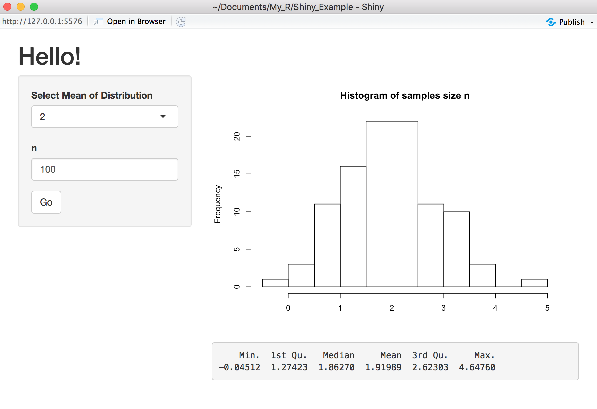
```

> Sve korake možete pratiti na prezentaciji postvaljenoj na sledećem linku: 
> https://tanjakec.github.io/DataDemocrcyKlikR1/DataDemocracyKlikR.html

Da bi nam bilo lakše i brže kopiraćemo date delove koda i ubacivati u neophodni deo aplikacije koju gradimo.

**Korak 1**: Kreirajte input sa input funkcijom

Ubacite dole dati deo koda kao što je prikazano na slajdu 23. Obratite pažnju na zagrade i zareze pri dodavanju novih argumenata. Krenucemo od dizajna korisničkog interfejsa (User Inteface, UI).

```{r eval=FALSE}
selectInput("Vector", "Select Mean of Distribution", 
            c(0, 1, 2, 3, 4, 5), 
            selected = 0, multiple = FALSE)
             
```

**Korak 2**: Kreiranje grafičkog prikaza

Na UI koji gradimo treba dodati grafikon za prikaz. Pri dodavanju dole datog koda, ponovo obratite pažnju na zareze i zagrade.

```{r eval=FALSE}
plotOutput("main_plot")
```
Nakon što smo postavili objekte za komunikaciju sa korisnikom na korisničkom interfjsu, sledeće šta treba da uradimo je da kažemo serveru koje operacije da odradi.

U sledećem koraku omogućićemo kreiranje histograma za prikaz 100 brojeva iz standardne normale distribucije (`rnorm`) koji će biti prikazan unutar definisanog output objekta `main_plot`.

**Korak 3**:

```{r eval=FALSE}
output$main_plot <- renderPlot(hist(rnorm(100), 
                                    breaks=15, 
                                    xlab="",
                                    main="Histogram of samples size n"))
```

Sad kada ste dobili ideju o funkcionisanju `Shiny` applikacija u R-u, zamenite kod unutar aplikacije za UI

```{r eval=FALSE}
 headerPanel("Hello!"),
    
    sidebarPanel(selectInput("Vector", "Select Mean of Distribution", 
                             c(0, 1, 2, 3, 4, 5), selected = 0, multiple = FALSE),
                 numericInput("n", "n", 50),
                 actionButton("go", "Go")),
    
    mainPanel(plotOutput("main_plot"),
              verbatimTextOutput("stats"))
```

i za server sa

```{r eval=FALSE}
randomVals <- eventReactive(input$go, input$n)
    
v <- function() {
    return(rnorm(randomVals(),mean=as.numeric(input$Vector)))  
    }
    
    output$main_plot <- renderPlot(hist(v(), 
                                   breaks=15, 
                                   xlab="",
                                   main="Histogram of samples size n"))
    
    output$stats <- renderPrint({summary(v())})

```

Kod cele aplikacije bi trebao da izgleda ovako:

```{r eval=FALSE}
#
# This is a Shiny web application. You can run the application by clicking
# the 'Run App' button above.
#
# Find out more about building applications with Shiny here:
#
#    http://shiny.rstudio.com/
#

library(shiny)

# Define UI for application that draws a histogram
ui <- fluidPage("Hello",

  selectInput("Vector", "Select Mean of Distribution", 
             c(0, 1, 2, 3, 4, 5), 
              selected = 0, multiple = FALSE),

  plotOutput("main_plot")
)
# Define server logic required to draw a histogram
server <- function(input, output) {
    
  output$main_plot <- renderPlot(hist(rnorm(100), 
                                    breaks=15, 
                                    xlab="",
                                    main="Histogram of samples size n"))
}


# Run the application 
shinyApp(ui = ui, server = server)
```

Nakon ovoga biće vam lakše da shvatite ideju i funkcionalno kreirane aplikacije za saobraćajne nezgode na teritoriji Beograda koju možete naći na sledećem repozitorijumu:

https://github.com/TanjaKec/OpenDataPlay

Srećno kodiranje i istraživanje mogućnosti datih kroz analize i igre sa otvorenim podacima 🙌🙌🙌


